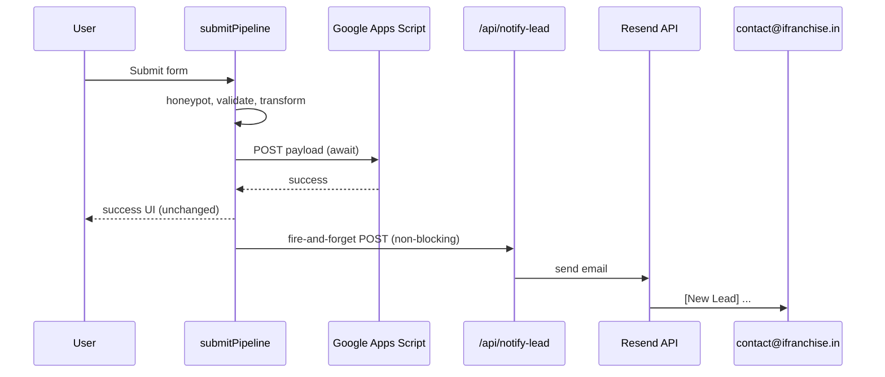

# Lead email notifications

Instant email alerts when any form submission succeeds and is stored in Google Sheets.

## Flow



## What is unchanged

- Form UI, validation, hooks, and success states
- Google Sheets / Apps Script payload and storage
- Rate handling and submission guard (double-click only)
- User-visible submission speed (notification runs after the Sheets response, in a microtask)

## What was added

| Piece | Role |
|-------|------|
| `src/lib/forms/utils/submitPipeline.js` | Calls `notifyLeadSubmission()` only when `submitToGoogleSheets` succeeds |
| `src/lib/forms/utils/leadNotification.js` | Client-side fire-and-forget `fetch` to the notify API |
| `api/notify-lead.js` | Vercel serverless handler |
| `api/lib/*` | Validation, field extraction, Resend email build/send |

All forms using `runFormSubmission` / `createFormSubmitter` are covered automatically, including future forms registered in the same pipeline.

## Email content

- **Subject:** `[New Lead] {Form Type} - {Name}`
- **Body:** Form type, submission time, name, phone, email, company (if any), message/inquiry, source page, page URL, referrer, and any extra submitted fields

## Environment variables

### Client (Vite — `.env` / Vercel with `VITE_` prefix)

| Variable | Required | Description |
|----------|----------|-------------|
| `VITE_LEAD_NOTIFY_ENABLED` | Production | Set to `true` to enable notifications |
| `VITE_LEAD_NOTIFY_SECRET` | Production | Shared secret; must match `LEAD_NOTIFY_SECRET` |
| `VITE_LEAD_NOTIFY_URL` | No | Default: `{origin}/api/notify-lead` |

### Server (Vercel — no `VITE_` prefix)

| Variable | Required | Description |
|----------|----------|-------------|
| `RESEND_API_KEY` | Yes | [Resend](https://resend.com) API key |
| `LEAD_NOTIFICATION_TO` | Yes | Recipient, e.g. `contact@ifranchise.in` |
| `LEAD_NOTIFICATION_FROM` | Yes | Verified sender, e.g. `Leads <notifications@ifranchise.in>` |
| `LEAD_NOTIFY_SECRET` | Yes | Same value as `VITE_LEAD_NOTIFY_SECRET` |
| `LEAD_NOTIFY_ALLOWED_ORIGINS` | Recommended | Comma-separated site origins for CORS. If unset, the service will reflect the request origin (auth still enforced by `LEAD_NOTIFY_SECRET`). |

## Production deployment (Vercel)

1. Add a [Resend](https://resend.com) account and verify your sending domain.
2. In **Vercel → Project → Settings → Environment Variables**, add all server variables for **Production** (and Preview if needed).
3. Add client variables (`VITE_LEAD_NOTIFY_*`) for Production.
4. Deploy. Vercel serves `api/notify-lead.js` as a serverless function; `vercel.json` excludes `/api/*` from the SPA rewrite.
5. Submit a test form on production and confirm the inbox receives one email per submission.

## Local testing

`npm run dev` (Vite) does **not** run the notify API. Use either:

```bash
npx vercel dev
```

Then set `.env` with notify variables and submit a form, or:

```bash
node scripts/verify-lead-notify.mjs
```

(requires server env vars in the shell or `.env` loaded by your shell)

## Failure behavior

- If Resend or the API fails, the form still succeeds; only a console warning is logged (`lead_notify_failed`).
- If notify env vars are missing, notifications are skipped silently (dev) or skipped when `VITE_LEAD_NOTIFY_ENABLED` is not `true`.
- No duplicate emails from double-click: the submission guard dedupes concurrent pipeline runs; one successful Sheets response triggers at most one notify call.

## Security

- `X-Lead-Notify-Key` must match `LEAD_NOTIFY_SECRET`.
- CORS is restricted to configured origins.
- `form_type` must be in the allowlist.
- Payload size is capped.

## Careers / future forms

- **Careers:** No sheet integration today; when a careers submitter uses `createFormSubmitter`, it will pick up notifications automatically.
- **New forms:** Add `form_type` to `api/lib/validateNotifyRequest.js` allowlist and `api/lib/extractLeadFields.js` labels if you want a friendly email label.
